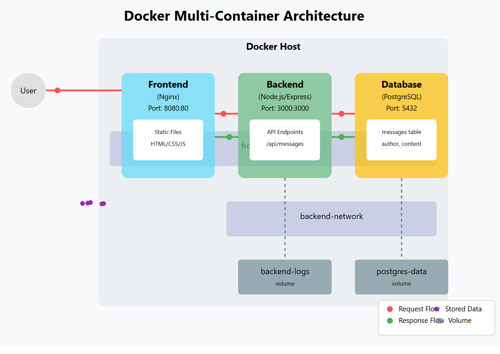

# Docker Learning Project

This project demonstrates Docker best practices with a simple multi-container application using Docker Compose. The application consists of three containers:




1. **Frontend**: A simple Nginx web server serving static HTML, CSS, and JavaScript
2. **Backend**: A Node.js/Express API server
3. **Database**: A PostgreSQL database for data persistence

The focus of this project is on Docker concepts rather than complex application logic.

## Key Docker Concepts Covered

- Multi-stage Dockerfile builds
- Docker Compose for multi-container orchestration
- Volume management for data persistence
- Container networking
- Environment variables and secrets management
- Docker best practices

## Project Structure

```
docker-learning-project/
├── docker-compose.yml      # Define and configure all services
├── .env                    # Environment variables for docker-compose
├── README.md               # Main project documentation
├── frontend/               # Nginx static web server
├── backend/                # Node.js API server
└── database/               # PostgreSQL database
```

## Getting Started

1. Clone this repository
2. Make sure Docker and Docker Compose are installed
3. Run `docker-compose up -d`
4. Access the application at http://localhost:8080

## Application Functionality

The application is a simple message board where users can:
- View all messages
- Add new messages

This simplicity allows us to focus on Docker concepts rather than complex application logic.

## Docker Concepts Explained

### Docker Containers
Containers are lightweight, standalone, executable packages that include everything needed to run an application. In this project, we have three containers that work together but remain isolated from each other.

### Docker Images
Docker images are read-only templates used to create containers. Each component has its own Dockerfile that defines how to build its image.

### Docker Volumes
Volumes are used for data persistence. We use volumes for:
- PostgreSQL data: ensures messages are preserved even if the container is removed
- Backend logs: preserves log data across container restarts

### Docker Networking
Containers communicate with each other through Docker networks. We use:
- frontend-network: connects the frontend and backend
- backend-network: connects the backend and database

### Environment Variables
Environment variables are used to configure containers without modifying their code. We use a `.env` file and pass variables through Docker Compose.

### Docker Compose
Docker Compose is a tool for defining and running multi-container Docker applications. Our `docker-compose.yml` file defines all three services and their relationships.


server {
    listen 80;
    server_name localhost;
    root /usr/share/nginx/html;
    index index.html;

    # Handle static files
    location / {
        try_files $uri $uri/ /index.html;
    }

    # Proxy API requests to the backend service
    location /api {
        proxy_pass http://backend:3000;
        proxy_http_version 1.1;
        proxy_set_header Upgrade $http_upgrade;
        proxy_set_header Connection 'upgrade';
        proxy_set_header Host $host;
        proxy_cache_bypass $http_upgrade;
        
        # CORS headers if needed
        add_header 'Access-Control-Allow-Origin' '*' always;
        add_header 'Access-Control-Allow-Methods' 'GET, POST, OPTIONS' always;
        add_header 'Access-Control-Allow-Headers' 'DNT,User-Agent,X-Requested-With,If-Modified-Since,Cache-Control,Content-Type,Range' always;
        add_header 'Access-Control-Expose-Headers' 'Content-Length,Content-Range' always;
    }
}
